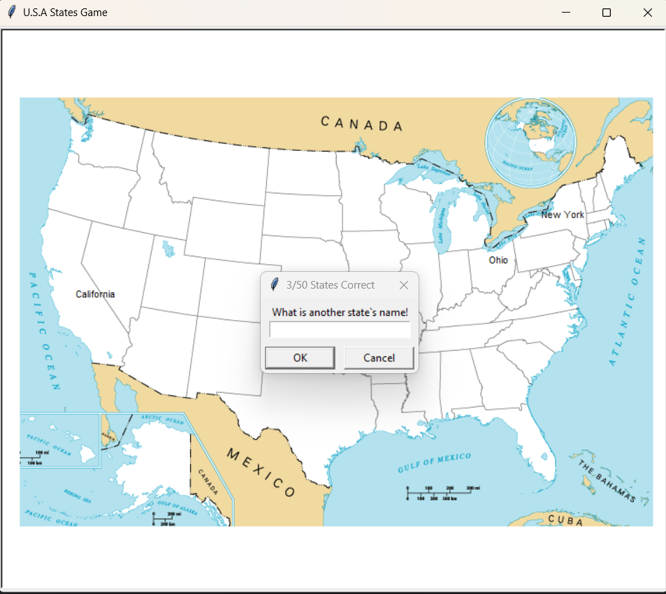

# 🇺🇸 USA States Game using Pandas

An interactive Python game built using Turtle Graphics and Pandas. 
The game reads U.S. state data from a CSV file and allows users to guess state names. 
Correct guesses are displayed on the map using coordinates.


## 🖼 Game Preview


## 🚀 Features
- Interactive map-based quiz game
- Uses Pandas for data handling
- Displays correct answers on map
- Tracks guessed states
- Beginner friendly Python project

## 🛠 Tech Stack
- Python
- Pandas
- Turtle Graphics


## 📂 Project Structure
US_States_game_Pandas/
│
├── main.py
├── 50_states.csv
├── blank_states_img.gif
├── image.png
├── README.md

## ▶ How to Run

1. Clone the repository
2. Install dependencies
3. Run main.py

```bash
pip install pandas
python main.py


---

## 🎯 Learning Outcomes
```md
## 🎯 Learning Outcomes
- Working with CSV using Pandas
- Python loops and conditions
- Turtle graphics basics
- Game logic building

## 📈 Future Improvements
- Score tracking system
- Timer feature
- Leaderboard
- UI enhancements

## 👩‍💻 Author
Divya Upadhyay

